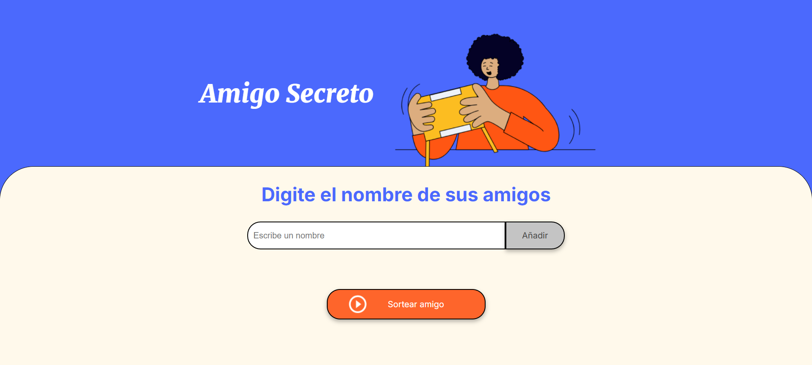

# Amigo Secreto

## Descripción

"Amigo Secreto" es una aplicación web interactiva que permite a los usuarios ingresar nombres de amigos en una lista y realizar un sorteo aleatorio para determinar quién será su "amigo secreto".

## Imagen del proyecto



## Características

- **Agregar nombres:** Los usuarios pueden escribir el nombre de un amigo en un campo de texto y agregarlo a una lista visible al hacer clic en el botón "Adicionar".
- **Validar entrada:** Si el campo de texto está vacío, se mostrará una alerta solicitando un nombre válido.
- **Visualizar la lista:** Los nombres ingresados se mostrarán en una lista debajo del campo de entrada.
- **Sorteo aleatorio:** Al hacer clic en el botón "Sortear Amigo", se seleccionará aleatoriamente un nombre de la lista y se mostrará en pantalla.

## Tecnologías utilizadas

- **HTML5:** Para la estructura de la aplicación.
- **CSS3:** Para el diseño y la apariencia visual.
- **JavaScript:** Para la lógica de interactividad y sorteos.

## Instrucciones de uso

1. Clona este repositorio:
   ```bash
   git clone https://github.com/sxntiBG/challenge-amigo-secreto-alura-one
   ```

2. Abre el archivo `index.html` en tu navegador web.

3. Ingresa nombres en el campo de texto y haz clic en "Añadir" para agregarlos a la lista.

4. Cuando termines de agregar nombres, presiona "Sortear Amigo" para obtener un resultado aleatorio.

## Estructura del proyecto

```
AmigoSecreto/
├── assets/
│   ├── amigo-secreto.png
│   ├── img-project.png
│   ├── play_circle_outline.png
├── app.js
├── index.html
├── README.md
├── style.css
```

## Mejoras futuras

- Permitir la eliminación de nombres de la lista.
- Agregar una opción para reiniciar el sorteo.
- Guardar la lista de nombres en el almacenamiento local del navegador.

## Challenge

Este proyecto forma parte de la formación **ONE - Oracle Next Education**, un programa educativo enfocado en el desarrollo de habilidades tecnológicas.

## Autor

Desarrollado por Santiago Zapata Ospina.